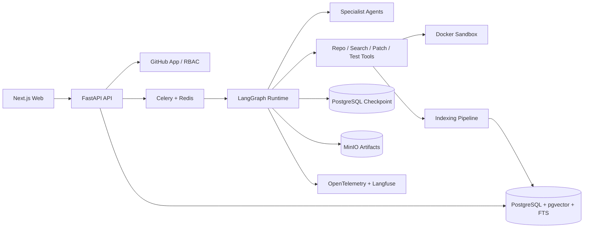

# RepoPilot V1.0 产品与实施方案

> 文档版本：v1.0-draft
> 制定日期：2026-07-06
> 目标版本：单租户、企业内部可部署的 RepoPilot V1.0
> 计划周期：30 周，150 个开发日，约 420–500 小时

## 1. 执行摘要

RepoPilot 是一个面向 GitHub Issue 的可验证软件维护 Agent。用户选择一个 Python 仓库、目标 commit 和 Issue 后，系统会在固定版本的代码上完成问题理解、代码检索、根因调查、修复计划、人工审批、沙箱修改、测试、独立代码审查和结果交付。

RepoPilot 不以“生成了多少代码”作为成功标准，而以以下结果作为成功标准：

- 是否找到了真正相关的文件和符号。
- 是否使用代码证据解释根因。
- 是否先复现问题，再修改代码。
- 是否通过目标测试和必要的回归测试。
- 是否控制修改范围，避免无关 Diff。
- 是否经过独立 Review Agent 审查。
- 是否可以在失败、中断和人工审批后恢复。
- 是否留下完整、可审计、可复现的执行记录。

V1.0 的定位不是多租户商业 SaaS，而是“一个团队可以部署到内部环境使用”的单租户企业版。它需要具备身份认证、仓库权限、任务隔离、沙箱安全、审计、备份恢复、可观测性、离线评测和部署升级能力，但不包含计费、多地域容灾和 Kubernetes 高可用集群。

## 2. 个人画像与方案取舍

### 2.1 当前已知画像

- 求职方向是 AI Agent 开发工程师和大模型应用算法工程师。
- 求职时预计拥有约一年正式工作经验。
- 计划用两个高质量项目证明超过常见一年经验候选人的独立交付能力。
- 项目必须使用 LangGraph、RAG 和多 Agent 协调。
- 不接受只做聊天、简单 PDF 问答或框架拼装。
- 希望项目有企业级工程深度和可量化评测。
- 当前技术路线以 Python 为主，适合从 Python 开源仓库切入。

### 2.2 由画像推导出的设计原则

1. **深度优先于语言数量**：V1.0 只支持 Python，不同时支持 Java、Go、Rust。
2. **可验证优先于炫技**：先做测试闭环、评测和安全，再做复杂自治能力。
3. **真实任务优先于自编演示**：核心评测使用真实 GitHub 历史 Issue 与已合并 PR。
4. **多 Agent 必须有权限边界**：调查 Agent 只读，Patch Agent 只能写临时 worktree，Review Agent 不复用 Patch Agent 的结论。
5. **企业单租户优先于 SaaS**：做 GitHub App/OAuth、RBAC、审计和隔离，但不做计费系统。
6. **为第二个项目复用底座**：模型网关、评测框架、Trace、任务队列、Checkpoint 和部署模板需要模块化。

## 3. 产品定义

### 3.1 一句话定义

RepoPilot 是一个把 GitHub Issue 转换为“有证据、有测试、有审查的候选补丁”的多 Agent 软件维护平台。

### 3.2 核心用户

- 维护 Python 开源项目的个人或小团队。
- 刚接手陌生代码库、需要快速定位问题的开发者。
- 希望在内部仓库中引入可控 Agent 工作流的研发团队。

### 3.3 典型用户故事

1. 作为维护者，我希望选择一个 Issue，让系统给出相关代码、根因假设和修改计划，但未经我批准不能改动代码。
2. 作为开发者，我希望系统在临时环境复现 Bug、生成补丁并运行测试，让我拿到可以人工审查的 Diff。
3. 作为 Reviewer，我希望每个结论都引用文件、行号和 commit，并看到测试、成本、模型和执行轨迹。
4. 作为管理员，我希望控制哪些用户能访问哪些仓库，并能删除仓库索引、吊销 GitHub 凭据和查看审计记录。

### 3.4 V1.0 完整闭环

```text
连接 GitHub 仓库
→ 固定目标 commit
→ 建立代码与文档索引
→ 导入或选择 Issue
→ 生成结构化问题定义
→ 检索代码与历史证据
→ 建立并验证根因假设
→ 生成修复计划
→ 人工批准
→ 临时 worktree 中复现和修改
→ Docker 沙箱运行测试
→ 独立 Review Agent 审查
→ 有限次数修正
→ 人工批准候选补丁
→ 导出 Diff、报告或创建 Draft PR
```

### 3.5 非目标

- 不自动合并 PR，不自动部署生产环境。
- 不支持任意大型功能开发。
- 不支持跨仓库原子修改。
- 不保证解决所有 Issue。
- 不把仓库内容当成可信指令。
- 不在 V1.0 做 IDE 插件、原生桌面端或移动端。
- 不在 V1.0 做 Kubernetes、多地域高可用和商业计费。

## 4. V1.0 范围与验收边界

### 4.1 支持范围

- 语言：Python 3.12。
- 测试：pytest 为主，允许仓库配置额外命令。
- 仓库：GitHub 公共仓库和授权的私有仓库。
- 任务：Bug、兼容性问题、小范围重构、明确的测试修复。
- 修改上限：默认不超过 5 个文件和 300 行净变更，可由管理员调整。
- 单次循环：最多 3 次 Patch–Test–Review 修正。
- 单任务执行时间：默认不超过 30 分钟。
- 部署：Linux 单机或单节点 Docker Compose。

### 4.2 V1.0 必须具备

- GitHub App 或 OAuth 登录和最小仓库权限。
- 管理员、维护者、观察者三种 RBAC 角色。
- 仓库、任务、索引和凭据隔离。
- PostgreSQL Checkpoint 与任务恢复。
- 混合代码 RAG 和 Reranker。
- 五个专业 Agent 和结构化契约。
- Docker 沙箱、默认断网、资源限制和临时 worktree。
- 方案审批与候选补丁审批两个 HITL 节点。
- Trace、日志、Token、成本、延迟和失败分类。
- 真实历史 Issue 回归集和消融实验。
- 备份、恢复、删除、导出和升级文档。
- Draft PR 创建必须经过显式人工确认。

## 5. 代码仓库选择

仓库选择基于 2026-07-06 的公开状态；正式采集前必须再次检查许可证、贡献规则、默认分支和测试命令。

### 5.1 最终推荐组合

| 仓库                                                   | 用途                         | 选择原因                                                                                  | 主要风险                                                 |
| ------------------------------------------------------ | ---------------------------- | ----------------------------------------------------------------------------------------- | -------------------------------------------------------- |
| [pallets/click](https://github.com/pallets/click)       | 主开发集，约 20 个任务       | 纯 Python、BSD-3-Clause、历史长、测试和文档齐全；CLI Bug 通常容易复现，适合建立第一条闭环 | 跨平台终端行为需要 Windows/Linux 差异处理                |
| [fastapi/typer](https://github.com/fastapi/typer)       | 相近领域验证集，约 10 个任务 | MIT、纯 Python、类型注解丰富、发布活跃；能验证系统对同领域不同架构的迁移能力              | 新版本内嵌 Click 代码，需按历史时间避免与 Click 数据泄漏 |
| [Kludex/starlette](https://github.com/Kludex/starlette) | 跨领域盲测集，约 15 个任务   | BSD-3-Clause、异步 Web 框架、测试覆盖高、代码边界清晰；可验证系统不是只会 CLI 仓库        | 异步、ASGI、WebSocket 问题难度明显更高                   |
| [encode/httpx](https://github.com/encode/httpx)         | 高难度扩展集，约 5 个任务    | BSD-3-Clause、同步/异步并存、协议与网络边界丰富；适合最终压力测试                         | 部分测试涉及网络、TLS、代理或多后端，沙箱复现成本较高    |

### 5.2 为什么不把 pytest 作为首批仓库

[pytest-dev/pytest](https://github.com/pytest-dev/pytest) 有大量真实 Issue 和优秀测试，但代码量、插件体系、兼容矩阵和历史包袱更重。它适合作为 V1.1 的极限泛化测试，不适合在 RAG、LangGraph 和沙箱尚未稳定时作为第一批任务。

### 5.3 数据集角色分配

- 开发集：Click 15 个 + Typer 5 个，可反复调试 Prompt、检索与图路由。
- 验证集：Click 5 个 + Typer 5 个，只用于阶段性模型选择。
- 盲测集：Starlette 15 个，直到 V1.0 候选版前不查看真实 PR Diff。
- 扩展集：HTTPX 5 个，只报告结果，不作为 V1.0 发布阻塞项。

### 5.4 历史 Issue 采集规则

GitHub 支持通过 `Fixes #123`、`Closes #123` 等关闭关键字关联 Issue 和 PR，也支持在 Timeline API 中读取关联事件。候选查询示例：

```text
repo:pallets/click is:issue is:closed linked:pr label:bug
repo:fastapi/typer is:issue is:closed linked:pr
repo:Kludex/starlette is:pr is:merged linked:issue
repo:encode/httpx is:pr is:merged linked:issue
```

每条数据至少保存：

```json
{
  "repository": "pallets/click",
  "issue_number": 123,
  "issue_created_at": "...",
  "issue_text_before_fix": "...",
  "base_commit": "...",
  "merged_pr": 456,
  "merge_commit": "...",
  "gold_changed_files": ["..."],
  "gold_patch": "...",
  "test_command": "pytest ...",
  "license": "BSD-3-Clause",
  "difficulty": "medium"
}
```

### 5.5 防止答案泄漏

1. 评测时 checkout 到 PR 修复前的 `base_commit`。
2. 索引仅包含该时间点已经存在的代码、文档和历史。
3. Issue 评论只保留 PR 创建前已存在的内容。
4. 隐藏关联 PR 标题、描述、评论、commit 和 Diff。
5. 开发、验证和盲测任务按仓库和时间双重切分。
6. 不把盲测 PR 作为 Few-shot 示例。
7. 最终评价优先看测试和语义正确性，不要求 Diff 与真实 PR 完全一致。

## 6. 总体架构



### 6.1 技术选型

| 层             | V1.0 选型                    | 理由                                         |
| -------------- | ---------------------------- | -------------------------------------------- |
| Agent 编排     | LangGraph                    | 状态、条件路由、Checkpoint、HITL、子图       |
| 模型网关       | 自定义 Provider Adapter      | 支持 DeepSeek V4 Flash/Pro，并允许替换供应商 |
| API            | FastAPI + Pydantic           | Python 生态、结构化契约、异步接口            |
| 后台任务       | Celery + Redis               | 长任务、取消、重试、队列隔离                 |
| 主数据库       | PostgreSQL                   | 业务数据、RBAC、审计、Checkpoint             |
| 向量与全文检索 | pgvector + PostgreSQL FTS    | 单节点可维护，满足 V1.0                      |
| 代码解析       | Python AST + Tree-sitter     | 结构化切分和多语言扩展预留                   |
| 对象存储       | MinIO                        | Diff、日志、测试报告、索引制品               |
| 沙箱           | Docker + 临时 Git worktree   | 隔离不可信代码执行                           |
| 前端           | Next.js                      | 任务状态、审批、Diff 和证据展示              |
| 可观测性       | OpenTelemetry + Langfuse     | Trace、模型调用、Token、成本、延迟           |
| 部署           | Docker Compose + Caddy/Nginx | 单租户内部部署和 TLS                         |

## 7. LangGraph 与多 Agent 设计

### 7.1 Agent 划分

#### Issue Analyst

- 将 Issue 转换为问题、期望行为、复现条件和验收标准。
- 判断信息是否不足。
- 生成初始检索问题。
- 只读，不访问 Patch 工具。

#### Code Investigator

- 使用混合 RAG、符号搜索和调用关系调查代码。
- 建立多个根因假设。
- 为假设绑定文件、行号、commit 和证据。
- 只读，不修改代码。

#### Fix Planner

- 选择待验证假设。
- 生成文件级修改计划、测试计划、风险和回滚方式。
- 输出必须进入 HITL，不允许直接调用 Patch 工具。

#### Patch Agent

- 只能操作任务专属临时 worktree。
- 优先生成或运行复现测试。
- 修改代码并读取确定性测试结果。
- 每轮只接收所需上下文，不读取管理员凭据。

#### Review Agent

- 独立检查需求覆盖、边界条件、无关修改、测试质量和安全风险。
- 不复用 Patch Agent 的隐藏推理。
- 输出 `approve`、`request_changes` 或 `reject`。

### 7.2 不做成 Agent 的组件

- Git clone、checkout、diff、worktree 创建和销毁。
- AST 解析、Chunk、Embedding、索引更新。
- 测试、Lint、类型检查和覆盖率计算。
- 命令白名单、权限校验和资源限制。
- 指标统计、成本计算、备份和删除。

### 7.3 主图节点

```text
START
→ authorize_repository
→ prepare_snapshot
→ ensure_index
→ analyze_issue
→ retrieve_context
→ investigate_root_cause
→ reproduce_issue
→ plan_fix
→ approve_plan (interrupt)
→ create_worktree
→ generate_patch
→ run_validation
→ review_patch
→ decide_retry
→ approve_delivery (interrupt)
→ export_artifacts / create_draft_pr
→ cleanup
→ END
```

### 7.4 关键路由规则

- 授权失败：立即终止，不进入索引。
- 信息不足：暂停并询问用户。
- 检索证据不足：最多进行两轮查询改写。
- 无法复现：降低置信度并要求用户选择继续或停止。
- 计划未批准：保持 Checkpoint，允许编辑后恢复。
- 测试或 Review 失败：最多三轮修正。
- 超过成本、时间或循环预算：自动暂停并请求人工接管。
- Draft PR：必须在第二个 HITL 节点显式确认。

### 7.5 核心 State

```python
class RepoPilotState(TypedDict):
    task_id: str
    tenant_id: str
    repository_id: str
    base_commit: str
    issue: dict
    stage: str

    issue_analysis: dict | None
    retrieval_queries: list[str]
    evidence: list[dict]
    hypotheses: list[dict]
    reproduction: dict | None
    patch_plan: dict | None
    plan_approval: dict | None

    attempts: list[dict]
    test_results: list[dict]
    review_findings: list[dict]
    delivery_approval: dict | None

    retry_count: int
    time_budget_seconds: int
    token_budget: int
    cost_budget_cny: float
    final_status: str | None
```

## 8. RAG 与代码理解方案

### 8.1 索引对象

- Python 模块、类、函数、方法和装饰器。
- pytest 测试函数、fixture 和参数化用例。
- README、贡献指南、架构说明和 API 文档。
- pyproject、tox、CI、pre-commit 等工程配置。
- 截止目标 commit 的历史 commit 和已关闭 Issue/PR 摘要。

### 8.2 Chunk 与元数据

代码按 AST 符号切分，文档按标题结构切分，配置按语义段落切分。每个 Chunk 至少保存：

- `tenant_id`、`repository_id`、`commit_sha`。
- 文件路径、语言、内容类型。
- 符号名、完整限定名、起止行号。
- 父模块/父类、导入、调用和被调用关系。
- 内容哈希、索引版本、Embedding 版本。

### 8.3 检索流程

```text
Issue / 错误日志
→ 查询分解与关键实体提取
→ PostgreSQL FTS/BM25 类关键词召回
→ pgvector Dense 召回
→ 文件名、符号、异常文本精确召回
→ 调用关系扩展
→ Reciprocal Rank Fusion
→ Cross-Encoder Rerank
→ 去重与上下文预算压缩
→ 带路径、行号、commit 的 Evidence Pack
```

### 8.4 增量索引

- 以 commit SHA 和内容哈希判定变更。
- 只重新解析新增或修改文件。
- 删除已不存在的 Chunk。
- 不覆盖旧 commit 索引，允许历史任务复现。
- 索引版本必须绑定解析器、Embedding 和 Chunk 策略版本。

### 8.5 RAG 评测

- File Recall@5/10。
- Symbol Recall@5/10。
- MRR、nDCG@10。
- 引用路径/行号有效率。
- Context Precision。
- Dense-only、FTS-only、Hybrid、Hybrid+Rerank 四组消融。

## 9. 工具与沙箱

### 9.1 工具清单

- `repo_clone`、`repo_checkout`、`repo_create_worktree`。
- `search_text`、`search_symbol`、`read_file_range`、`find_references`。
- `retrieve_evidence`、`get_repository_rules`。
- `apply_patch`、`git_diff`、`git_status`。
- `run_reproduction`、`run_tests`、`run_lint`、`run_type_check`。
- `collect_coverage`、`export_report`、`create_draft_pr`。

### 9.2 沙箱基线

- 非 root 用户。
- 默认禁网；确有依赖安装需求时使用受控构建阶段，而非运行阶段联网。
- 只读基础镜像，任务目录为临时卷。
- CPU、内存、磁盘、进程数和墙钟时间限制。
- 不挂载 Docker Socket、宿主 SSH、GitHub Token 或模型密钥。
- stdout/stderr 大小限制和敏感信息脱敏。
- 命令使用数组参数，不经过 shell 字符串拼接。
- 任务结束销毁容器和 worktree，保留经过脱敏的制品。

### 9.3 Prompt Injection 防御

- 仓库代码、注释、Issue 和文档统一标记为不可信数据。
- 系统策略和工具权限不从仓库内容中动态覆盖。
- Agent 无法自行扩大工具白名单。
- 任何“读取密钥、联网、删除文件、跳过测试”指令都由策略层拒绝。
- 建立恶意仓库测试集验证拒绝行为。

## 10. 身份、权限与数据治理

### 10.1 RBAC

| 角色       | 权限                                             |
| ---------- | ------------------------------------------------ |
| Admin      | 配置 GitHub App、仓库、用户、预算、备份与删除    |
| Maintainer | 创建任务、审批计划/补丁、创建 Draft PR           |
| Viewer     | 查看获授权仓库的任务、证据和报告，不可执行写操作 |

### 10.2 凭据

- GitHub Token 加密存储，不写日志。
- 使用最小权限 GitHub App 安装令牌。
- 令牌按需获取并尽快过期。
- 支持吊销、轮换和连接测试。
- Patch Agent 与沙箱永远不接收 Token。

### 10.3 数据生命周期

- 仓库连接删除后，索引、对象制品和缓存异步清除。
- 审计日志按配置期限保留。
- 支持任务报告和审计记录导出。
- 私有代码不得用于跨租户训练或 Few-shot 示例。
- 删除操作记录操作者、范围、时间和结果。

## 11. API、数据模型与前端

### 11.1 核心 API

```text
POST   /auth/github/callback
GET    /repositories
POST   /repositories/connect
POST   /repositories/{id}/index
GET    /repositories/{id}/index-status

POST   /tasks
GET    /tasks/{id}
POST   /tasks/{id}/cancel
POST   /tasks/{id}/resume
POST   /tasks/{id}/approve-plan
POST   /tasks/{id}/approve-delivery
GET    /tasks/{id}/events
GET    /tasks/{id}/artifacts
POST   /tasks/{id}/draft-pr

GET    /admin/audit-logs
POST   /admin/backups
POST   /admin/restore-check
DELETE /repositories/{id}
```

### 11.2 核心数据表

- `users`、`roles`、`repository_permissions`。
- `github_installations`、`repositories`、`repository_snapshots`。
- `index_versions`、`code_chunks`、`symbol_edges`。
- `issues`、`tasks`、`task_events`、`approvals`。
- `agent_runs`、`tool_calls`、`model_calls`。
- `artifacts`、`test_results`、`review_findings`。
- `audit_logs`、`deletion_jobs`、`backup_runs`。

### 11.3 前端页面

- 登录与仓库授权。
- 仓库列表、索引状态和 commit 选择。
- Issue 导入与任务创建。
- LangGraph 当前节点、历史节点和等待状态。
- Evidence 浏览器：路径、行号、commit、检索分数。
- 根因假设和修复计划审批。
- Diff、测试、Lint、类型检查和 Review 页面。
- 成本、延迟、Token 和失败详情。
- 管理员权限、审计、备份和删除页面。

## 12. 评测与质量门禁

### 12.1 基线

必须保留以下对照：

1. 单 Agent + 文本搜索。
2. 单 Agent + Dense RAG。
3. 多 Agent + Hybrid RAG。
4. 多 Agent + Hybrid RAG + Reranker + Review 循环。

### 12.2 指标

#### 检索

- 真实修改文件 Recall@10。
- 真实修改符号 Recall@10。
- MRR、nDCG、Context Precision。

#### 任务

- Issue 可复现率。
- 根因假设人工评分。
- 修改文件命中率。
- 目标测试通过率、全量测试通过率。
- 无关修改率和平均 Diff 大小。
- Review Agent 有效缺陷发现率。

#### 系统

- 任务完成率、中断恢复率、取消成功率。
- P50/P95 延迟、Token 和人民币成本。
- Worker 崩溃后的重复副作用次数。
- 越权访问、未授权写入和沙箱联网次数。

### 12.3 V1.0 发布门禁

- 至少 40 条核心历史 Issue 可稳定重放，50 条完成数据清洗。
- Hybrid+Rerank 的 File Recall@10 不低于 85%，且优于 Dense-only 基线。
- 所有最终报告中的代码引用可定位到固定 commit。
- 所有成功任务均有目标测试和全量/约定回归测试结果。
- 两个 HITL 节点均可中断、跨进程恢复并保留审计。
- Worker 强制终止后，任务能恢复且不重复创建 PR。
- 权限矩阵、仓库隔离和删除链路通过集成测试。
- 沙箱默认断网、无宿主密钥、无 Docker Socket。
- 完成一次备份恢复演练和一次恶意仓库演练。
- 至少 5 名外部开发者完成试用并留下结构化反馈。
- 发布评测报告必须同时展示成功和失败案例。

## 13. 非功能目标

### 13.1 单节点容量目标

- 10 个并发用户。
- 3 个并发 Agent 任务，索引任务单独队列。
- 支持 100 万代码 Chunk 以内的单租户总索引规模。
- 普通 API P95 小于 500 ms，不含 Agent 和索引任务。
- 任务事件延迟小于 2 秒。

### 13.2 可靠性目标

- 月度可用性目标 99.5%（排除计划维护和外部模型故障）。
- 已持久化任务恢复成功率不低于 99%。
- RPO 24 小时，RTO 4 小时。
- 每次发布保留数据库迁移和回滚说明。

### 13.3 成本目标

- Flash 模型负责分类、查询改写和大部分简单节点。
- Pro 模型仅用于复杂根因分析、Patch 和最终 Review。
- 每个任务配置 Token、人民币、时间和循环硬预算。
- 开发阶段优先本地 PostgreSQL、Redis、MinIO 和开源可观测组件。

## 14. 里程碑与工期

| 里程碑                |     开发日 | 主要结果                                    |
| --------------------- | ---------: | ------------------------------------------- |
| M0 产品冻结与基准     |    D1–D10 | 范围、ADR、10 条历史 Issue、单 Agent 基线   |
| M1 平台骨架           |   D11–D25 | API、数据库、队列、模型网关、基础 CI        |
| M2 代码索引与 RAG     |   D26–D50 | AST Chunk、混合召回、Rerank、检索评测       |
| M3 LangGraph 调查流程 |   D51–D70 | State、Checkpoint、三个只读 Agent、计划审批 |
| M4 沙箱与补丁闭环     |   D71–D95 | worktree、Docker、Patch、测试、Review 循环  |
| M5 企业权限与治理     |  D96–D112 | GitHub App、RBAC、审计、删除、凭据管理      |
| M6 产品界面与可观测   | D113–D128 | Web、SSE、Evidence、Diff、Trace、成本       |
| M7 V1.0 硬化与发布    | D129–D150 | 50 条数据、盲测、安全、恢复、试用和发布材料 |

详细到天的任务见 `REPOPILOT_V1_DAILY_TASKS.md`。

## 15. 测试策略

- 单元测试：State reducer、权限、Chunk、Fusion、预算、策略。
- 契约测试：模型结构化输出、GitHub Adapter、Tool 输入输出。
- 集成测试：PostgreSQL、Redis、MinIO、Checkpoint、GitHub Webhook。
- E2E：从仓库连接到 Diff 导出和 Draft PR。
- Agent 回归：固定模型版本、Prompt 版本、索引版本和数据集版本。
- 故障注入：模型超时、Worker 崩溃、数据库短断、沙箱超时、重复 Webhook。
- 安全测试：越权、恶意仓库、Prompt Injection、命令注入、路径穿越、Secret 泄漏。
- 性能测试：索引吞吐、检索 P95、SSE 事件、并发任务和队列积压。

## 16. 主要风险与控制措施

| 风险                    | 影响           | 控制措施                                                        |
| ----------------------- | -------------- | --------------------------------------------------------------- |
| 历史 PR 泄漏答案        | 评测失真       | 固定 base commit、时间过滤、盲测隔离                            |
| Docker 不是绝对安全边界 | 宿主机风险     | 非 root、断网、资源限制、无 Socket/密钥；公开部署前评估更强沙箱 |
| 多 Agent 成本高但无收益 | 项目失去说服力 | 强制单 Agent 基线和消融实验                                     |
| 仓库安装过程不稳定      | 无法复现       | 选择可锁定依赖的任务，保存镜像与构建日志                        |
| LLM 生成无关大 Diff     | 维护风险       | 文件/行数上限、计划审批、Review 和策略拒绝                      |
| 私有代码泄漏            | 严重安全问题   | 最小权限、日志脱敏、供应商配置、删除和审计                      |
| 30 周范围仍偏大         | 延期           | Python-only、单节点、单租户；Draft PR 之外不做 GitHub 写操作    |

## 17. 决策记录

| 决策          | 结论                        | 原因                                      |
| ------------- | --------------------------- | ----------------------------------------- |
| 客户端        | 响应式 Web                  | 展示状态、证据和 Diff 足够，不做 IDE 插件 |
| 部署形态      | 单租户 Docker Compose       | 满足企业内部部署并控制工期                |
| 数据库        | PostgreSQL + pgvector + FTS | 减少组件数量，便于备份恢复                |
| 多 Agent 模式 | 显式 StateGraph + 工具委派  | 比自由 Swarm 更可控、更容易评测           |
| 语言范围      | Python-only                 | 与个人技术栈和求职目标匹配，保证深度      |
| 主评测仓库    | Click、Typer、Starlette     | 从 CLI 到异步 Web，形成难度和领域梯度     |
| 自动化边界    | 最多 Draft PR               | Merge 和 Deploy 风险过高，必须留给人类    |

## 18. 求职交付物

V1.0 发布时必须同时产出：

- 可公开访问的演示环境或录制完整演示。
- 中英文 README。
- 产品说明、系统架构、数据流和威胁模型。
- 真实 Issue 数据集构建说明和防泄漏策略。
- RAG 评测与多 Agent 消融报告。
- 3 个成功案例和至少 3 个失败案例复盘。
- 性能、成本、沙箱安全和备份恢复报告。
- Docker Compose 一键部署和升级文档。
- 5–8 分钟产品演示视频。
- 20 分钟技术深挖讲解稿。
- 简历可量化项目描述，但只填写真实测得的数字。

## 19. V1.0 完成定义

只有同时满足以下条件才标记 V1.0：

1. 一个新用户可以按照文档完成部署、GitHub 授权和首个任务。
2. 任务可以从 Issue 走到有证据、有测试、有 Review 的候选 Diff。
3. 方案和补丁均需要显式人工审批。
4. 任务中断后可以恢复，重试不会重复外部副作用。
5. 私有仓库、凭据、索引、日志和制品具备权限与删除边界。
6. 历史 Issue 评测、消融、性能和安全报告可以复现。
7. 至少五名非作者用户完成试用。
8. 已知限制、失败案例和不支持范围写入发布说明。

## 20. 参考来源

- [LangGraph](https://github.com/langchain-ai/langgraph)
- [LangGraph 101](https://github.com/langchain-ai/langgraph-101)
- [GitHub：关联 Pull Request 与 Issue](https://docs.github.com/en/issues/tracking-your-work-with-issues/using-issues/linking-a-pull-request-to-an-issue)
- [GitHub Issue Timeline API](https://docs.github.com/en/rest/issues/timeline?apiVersion=2022-11-28)
- [GitHub Issue/PR 搜索语法](https://docs.github.com/en/search-github/searching-on-github/searching-issues-and-pull-requests)
- [pallets/click](https://github.com/pallets/click)
- [fastapi/typer](https://github.com/fastapi/typer)
- [Kludex/starlette](https://github.com/Kludex/starlette)
- [encode/httpx](https://github.com/encode/httpx)
